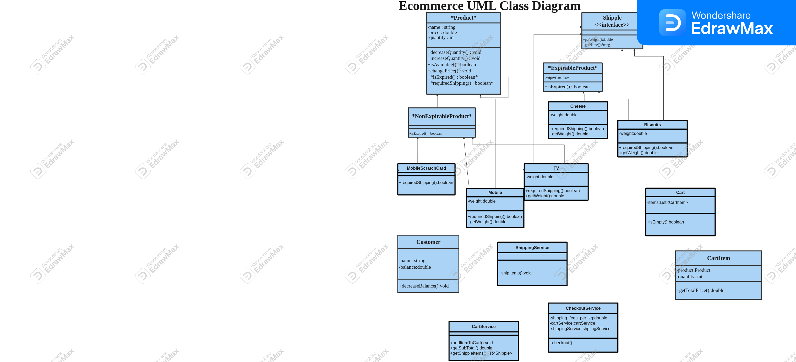

# ecommerce-challenge

the UML class diagram for the E-commerce system classes.

### 1. **Product (Abstract Class)**
   - **Attributes**: `name: String`, `price: double`, `quantity: int`
   - **Methods**: `getName()`, `getPrice()`, `getQuantity()`, `reduceQuantity(int)`, `isAvailable(int)`, `isExpired()`, `requiresShipping()`

### 2. **ExpirableProduct (Abstract Class)**
   - **Inherits**: `Product`
   - **Attributes**: `expiryDate: Date`
   - **Methods**: `isExpired()`
### 3. **NonExpirableProduct (Class)**
 - **Inherits**: `Product`
 - **Methods**: `isExpired()`
### 4. **Shippable (Interface)**
 - **Methods**: `getWeight()`
### 5. **Specific Product Classes**
 - **Cheese (Class)**: Implements `ExpirableProduct`, `Shippable`
 - **Biscuits (Class)**: Implements `ExpirableProduct`, `Shippable`
 - **TV (Class)**: Implements `NonExpirableProduct`, `Shippable`
 - **MobileScratchCard (Class)**: Extends `NonExpirableProduct`
### 6. **CartItem (Class)**
 - **Attributes**: `product: Product`, `quantity: int`
 - **Methods**: `getProduct()`, `getQuantity()`, `getTotalPrice()`
### 7. **Cart (Class)**
 - **Attributes**: `items: List<CartItem>`
 - **Methods**: `add(Product, int)`, `getItems()`, `isEmpty()`, `calculateSubtotal()`, `getShippableItems()`
### 8. **Customer (Class)**
 - **Attributes**: `name: String`, `balance: double`
 - **Methods**: `getName()`, `getBalance()`, `deductBalance(double)`
### 9. **ShippingService (Class)**
 - **Methods**: `shipItems(List<Shippable>)`
### 10. **CheckoutService (Class)**
 - **Attributes**: `SHIPPING_FEE_PER_KG: double`
 - **Methods**: `checkout(Customer, Cart)`
 

